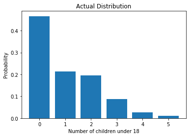
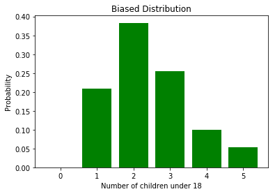

[Think Stats Chapter 3 Exercise 1](http://greenteapress.com/thinkstats2/html/thinkstats2004.html#toc31) (actual vs. biased)

>> ### Chapter 3 Exercise 1
Something like the class size paradox appears if you survey children and ask how many children are in their family. Families with many children are more likely to appear in your sample, and families with no children have no chance to be in the sample.

Use the NSFG respondent variable `numkdhh` to construct the actual distribution for the number of children under 18 in the respondents' households.

Now compute the biased distribution we would see if we surveyed the children and asked them how many children under 18 (including themselves) are in their household.

Plot the actual and biased distributions, and compute their means.


```python
import nsfg
import matplotlib.pyplot as plt
import numpy as np
```


```python
df = nsfg.ReadFemResp()
```

#### Actual Distribution PMF
First I'll compute the actual PMF based on the data, then plot its distribution. Not using the book's premade function, but this part is fairly straightforward


```python
freq = {}
for child in df['numkdhh']:
    freq[child] = freq.get(child, 0) + 1
pmf = {}
for f in freq:
    pmf[f] = freq[f]/len(df['numkdhh'])  # normalizing freq dict yields PMF
pmf
```


    {3: 0.08713855815779144,
     0: 0.46617820227659296,
     2: 0.19625801386889966,
     1: 0.21405207379301322,
     4: 0.025644380478869553,
     5: 0.01072877142483318}


```python
probabilities = sorted(pmf.items())  # returns list of tuples
x, p = zip(*probabilities)
plt.bar(x,p)
plt.xlabel('Number of children under 18')
plt.ylabel('Probability')
plt.title('Actual Distribution')
plt.show()
```





```python
mean = 0 
for i in range(len(x)):
    mean += x[i] * p[i]
print('Mean of actual distribution:', mean)
```

    Mean of actual distribution: 1.024205155043831


#### Biased Distribution
The calculation of the biased distribution is interesting. Since we're asking the children how many of them are in each family, consider the following cases:
1. 0 Children - we can't ask children that don't exist how many of them there are, so our PMF from above is going to collapse here. However this points to the biased nature of this sampling/child-asking method! Only families with children are going to be represented in the hypothetical survey.
2. 1 Child - Since there's only 1 child to ask, the PMF at 1 should stay the same between the biased and unbiased distribution. 
3. 2 or more children - Now we'll be overrepresenting. If we ask 2 children how many are in their (2-child) household, they'll each say 2 and 2*2 = 4. Similarly if we ask 3 children how many are in their (3-child) household they'll say 3 * 3 * 3 = 9.

Note this can be achieved by scaling the existing pmf probability values by a multiplicative factor then normalizing. In this case it works out nicely and **we can replace p(x) in the unbiased PMF with x * p(x) in the biased PMF, as our scale factor is equal to the number of children x.**


```python
pmf_b = pmf.copy()
newp_sum = 0
for child, p in pmf_b.items():
    pmf_b[child] = child * p  # Bias the PMF from child-perspective, works cause 0*p, 1*p, 2*p etc
    newp_sum += pmf_b[child]
for child, p in pmf_b.items():  # Normalize result
    pmf_b[child] /= newp_sum
pmf_b
```


    {3: 0.25523760858456823,
     0: 0.0,
     2: 0.38323965252938175,
     1: 0.20899335717935616,
     4: 0.10015329586101175,
     5: 0.052376085845682166}


#### Plot comparisons

To recap, on the PMF plot we'd expect 0 to collapse in the biased distribution, 1 to stay about the same, and anything more than 1 to start scaling up.

**This is indeed what happens and you can see the mean more than doubles for the biased compared to the unbiased distribution.**


```python
mean_b = 0
probabilities_b = sorted(pmf_b.items())  # returns list of tuples
x_b, p_b = zip(*probabilities_b)
plt.bar(x_b,p_b, color='g')
plt.xlabel('Number of children under 18')
plt.ylabel('Probability')
plt.title('Biased Distribution')
plt.show()
```





```python
for i in range(len(x_b)):
    mean_b += x_b[i] * p_b[i]
print('mean of biased distribution:', mean_b)
```

    mean of biased distribution: 2.403679100664282


