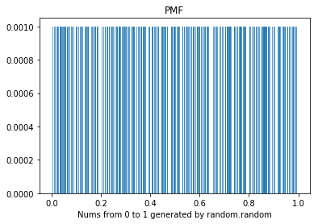
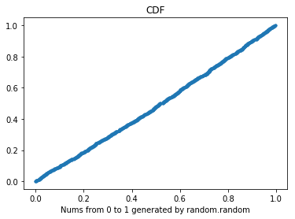

[Think Stats Chapter 4 Exercise 2](http://greenteapress.com/thinkstats2/html/thinkstats2005.html#toc41) (a random distribution)

>> ### Chapter 4 Exercise 2
The numbers generated by random.random are supposed to be
uniform between 0 and 1; that is, every value in the range should have the
same probability.
Generate 1000 numbers from random.random and plot their PMF and CDF.
Is the distribution uniform?


```python
import numpy as np
import matplotlib.pyplot as plt
```

#### Generate random numbers, construct PMF dict


```python
rand1000 = [np.random.random() for x in range(1000)]
```


```python
freq = {}
for n in rand1000:
    freq[n] = freq.get(n, 0) + 1
pmf = {}
for f in freq:
    pmf[f] = freq[f]/len(rand1000)  # normalizing freq dict yields PMF
```

#### Plot the PMF for the random numbers


```python
width = 1/1000
probabilities = sorted(pmf.items())  # returns list of tuples
x, p = zip(*probabilities)
plt.bar(x, p, width, alpha=0.7)
plt.title('PMF')
plt.xlabel('Nums from 0 to 1 generated by random.random')
plt.show()
```





#### Plot the CDF for the random numbers
To plot the CDF I've set the y-axis probabilities using np.arange: listing out each number from 1 to 1000 and dividing each by 1000. The x-axis sorts all the randomly generated numbers from np.random.random(). When plotted this way, it's clear the distribution is uniform as the plot is roughly linear. As an experiment I also ran this for random numbers up to 10,000 and the line becomes even straighter as expected.

In terms of whether this is truly random, there's a good discussion here on how the implementation is based on a Mersenne twister sequence, and hence pseudorandom: https://stackoverflow.com/questions/7029993/differences-between-numpy-random-and-random-random-in-python. This would matter a great deal if the application was serious cryptography.

However, since the random number generation is deterministic, you could 'seed' the generate with np.random(seed) so the results could be replicated by others, which is handy.


```python
n = len(rand1000)
x = np.sort(rand1000)
y = np.arange(1, len(x)+1) / n
plt.plot(x,y, marker='.',linestyle='none')
plt.xlabel('Nums from 0 to 1 generated by random.random')
plt.title('CDF')
plt.show()
```



