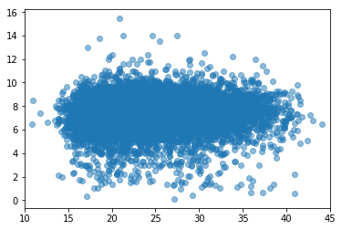
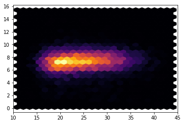
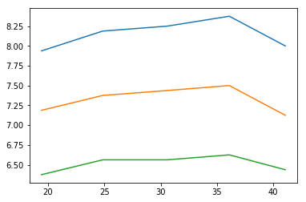

[Think Stats Chapter 7 Exercise 1](http://greenteapress.com/thinkstats2/html/thinkstats2008.html#toc70) (weight vs. age)

>> ### Ch 7 Ex 1


```python
import nsfg
import matplotlib.pyplot as plt
import numpy as np
```


```python
preg = nsfg.ReadFemPreg()
live = preg[preg.outcome == 1]
df = live.filter(['agepreg', 'totalwgt_lb'], axis=1).dropna()
age = df['agepreg']
weight = df['totalwgt_lb']
```

#### Scatterplots of Pregnancy Age vs BirthWeight


```python
plt.scatter(age, weight, alpha=0.5)
plt.xlim([10, 45])
plt.show()
```





```python
plt.hexbin(age, weight, gridsize=25, cmap='inferno')
plt.xlim([10, 45])
plt.show()
```





#### Pearson's Correlation Coeff. Calc.


```python
mean_age = np.mean(age)
mean_weight = np.mean(weight)
age_dev = age - mean_age
weight_dev = weight - mean_weight
age_std = np.std(age)
weight_std = np.std(weight)
```


```python
pearson_num = np.dot(age_dev, weight_dev)
n = len(age_dev)
pearson_den = (n-1) * age_std * weight_std
```


```python
r = pearson_num / pearson_den
r
```


    0.06884158725909464


#### Spearman's Rank Correlation Calc.


```python
age_rank = age.rank()
weight_rank = weight.rank()
```


```python
mean_age = np.mean(age_rank)
mean_weight = np.mean(weight_rank)
age_dev = age_rank - mean_age
weight_dev = weight_rank - mean_weight
age_std = np.std(age_rank)
weight_std = np.std(weight_rank)
```


```python
spearman_num = np.dot(age_dev, weight_dev)
n = len(age_dev)
spearman_den = (n-1) * age_std * weight_std
```


```python
rho = spearman_num / spearman_den
rho
```


    0.09462051028338063


#### Binned Age vs Percentile of Weight for each bin 


```python
bins = np.arange(10, 48, 6)
index = np.digitize(age, bins)
groups = df.groupby(index)

ages_grp = [g.agepreg.mean() for i, g in groups][1:]
```


```python
def ecdf(sample):
    n = len(sample)
    x = np.sort(sample)
    y = np.arange(1, len(x)+1) / n
    return x, y

cdf = [ecdf(g.totalwgt_lb) for i, g in groups][1:]
seventyfive=[]

for c in cdf:
    z = c[1]
    zi = z * 100
    zii = zi.astype(int)
    idx = np.where(zii == 75)
    seventyfive.append(c[0][idx][0])
plt.plot(ages_grp, seventyfive)

fifty=[]
for c in cdf:
    z = c[1]
    zi = z * 100
    zii = zi.astype(int)
    idx = np.where(zii == 50)
    fifty.append(c[0][idx][0])
plt.plot(ages_grp, fifty)

twentyfive=[]
for c in cdf:
    z = c[1]
    zi = z * 100
    zii = zi.astype(int)
    idx = np.where(zii == 25)
    twentyfive.append(c[0][idx][0])
plt.plot(ages_grp, twentyfive)


plt.show()
```





#### Conclusion
The correlation between mother's age and birthweight of child is very weak to non-existent. You can first see this by the relative flatness (no positive slope) by looking at the Hex Bin chart - it barely slopes up. Both measures of correlation confirm this. Since Spearman > Pearson, it could be that there's a non-linear relationship at play here. Plotting out binned age by percentile weights for each bin does suggest a non-linearity in the data.

