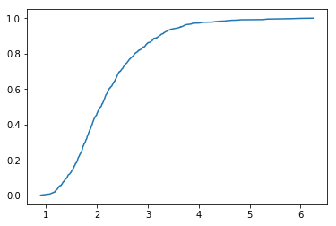
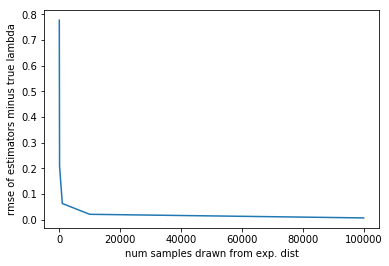

[Think Stats Chapter 8 Exercise 2](http://greenteapress.com/thinkstats2/html/thinkstats2009.html#toc77) (scoring)

>> ### Ch 8 Ex 2


```python
import numpy as np
import matplotlib.pyplot as plt
```


```python
from scipy import stats
lam_est = []
for i in range(1000):
    samp = np.random.exponential(1.0/2, 10)  # np.random takes rate parameter to generate samples
    lamhat = 1.0 / np.mean(samp)  # mean of exp. dist is 1/lambda
    lam_est.append(lamhat)  # save all lambda-hat estimates for each run of sim
    
mean_diff_sq = [(est - 2)**2 for est in lam_est]  # lambda-hat - lambda then squared for every sim-run
mse = np.mean(mean_diff_sq)  # mean of those squared diff is MSE
rmse = np.sqrt(mse)  # finally get RMSE
rmse
```


    0.7995728225994868


```python
def ecdf(sample):
    n = len(sample)
    x = np.sort(sample)
    y = np.arange(1, len(x)+1) / n
    return x, y

x, y = ecdf(lam_est)
plt.plot(x,y)
plt.show()
```





```python
idx5 = np.where(y == .05)
idx95 = np.where(y == .95)
print('90% CI:', x[idx5],',', x[idx95])
```

    90% CI: [1.25238098] , [3.64683612]


```python
ns = [10, 100, 1000, 10000, 100000]
rmses = [.777, .208, .0626, .0205, .0064]
plt.plot(ns, rmses)
plt.xlabel('num samples drawn from exp. dist')
plt.ylabel('rmse of estimators minus true lambda')
plt.show()
```





