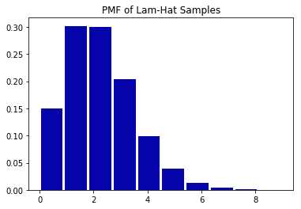

[Think Stats Chapter 8 Exercise 3](http://greenteapress.com/thinkstats2/html/thinkstats2009.html#toc77)

---

>> ### Chapter 8 Ex 3
For the below exercise - assume that the average time between goals is lambda=2. Then you can use np.random.exponential with the rate parameter Beta = 1/lambda to simulate a game and a team with this scoring rate. With this approach, any time an 'event' (goal) occurs, add 1 to the goal count. However, if the total time elapsed (based on summed increments of the expo r.v.), then end the game.

These goal counts also become estimates of lambda hat, which can be used to calculate the mean error and the RMSE. The RMSE of this method converges around 1.4, and the mean error converges to 0 (so it is in this sense unbiased).


```python
import numpy as np
import matplotlib.pyplot as plt
```


```python
def soccer_sim(lam):
    goal_time = 0
    goal_count = 0
    while True:
        goal_time += np.random.exponential(1.0/lam)
        if goal_time > 1:
            break
        goal_count +=1
    return goal_count
```


```python
result = []
for i in range(100000):
    result.append(soccer_sim(2))
```


```python
mean_diff_sq = [(r - 2)**2 for r in result]  # lambda-hat - lambda then squared for every sim-run
mse = np.mean(mean_diff_sq)  # mean of those squared diff is MSE
rmse = np.sqrt(mse)  # finally get RMSE
rmse
```


    1.4099148910483923


```python
errors = [r-2 for r in result]
np.mean(errors)
```


    -0.0014


```python
plt.hist(result, color='#0504aa', bins=10, rwidth=0.9, normed=True)
plt.title('PMF of Lam-Hat Samples')
plt.show()
```




---